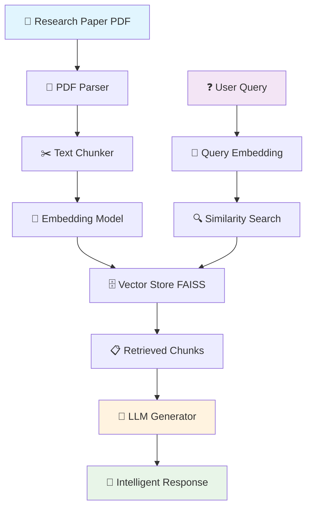
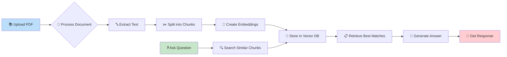
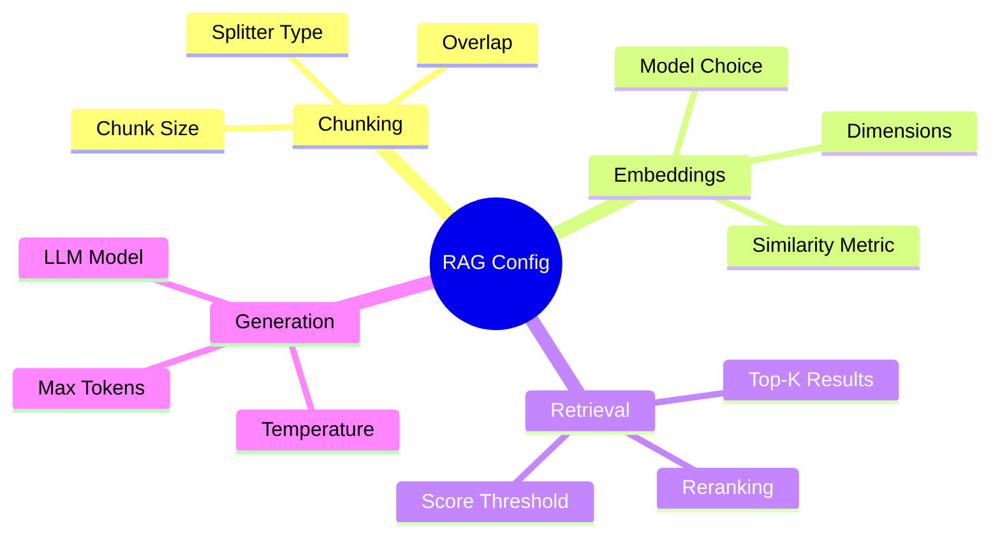
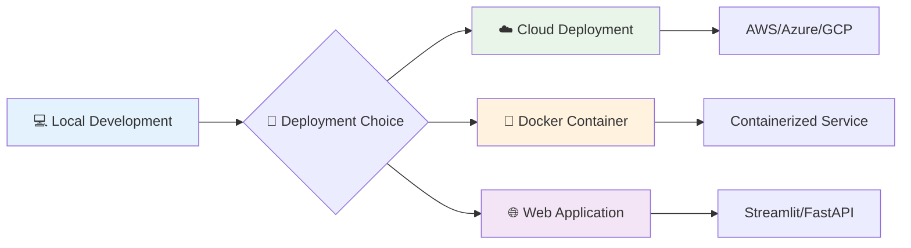

# 🧠 RAG-Based Pipeline for Research Paper Analysis

<div align="center">


**🚀 Transform Research Papers into Interactive AI Conversations**

*Ask questions, get intelligent answers, unlock knowledge from any PDF research paper!*

</div>

---

## 🎯 What Makes This Special?

<table>
<tr>
<td width="50%">

### 🔥 **Intelligent Document Understanding**
- **Smart PDF Processing** - Extracts and understands research papers
- **Context-Aware Responses** - Answers based on actual document content
- **Multi-Document Support** - Query across multiple research papers
- **Real-time Processing** - Get answers in seconds, not minutes

</td>
<td width="50%">

### ⚡ **Cutting-Edge Technology**
- **RAG Architecture** - Retrieval + AI Generation = Magic
- **Vector Embeddings** - Semantic search through documents
- **LangChain Integration** - Production-ready LLM pipeline
- **FAISS Vector Store** - Lightning-fast similarity search

</td>
</tr>
</table>

---

## 🎬 See It In Action

```
🔍 Query: "What are the main findings about neural networks?"

🤖 AI Response: "Based on the research paper, the main findings about neural networks include:
1. Improved accuracy of 94.2% using attention mechanisms
2. Reduced training time by 40% with optimized architectures
3. Better generalization across different datasets..."

📄 Source: sample.pdf (Page 15-17)
```

---

## 🏗️ System Architecture



---

## 🚀 Quick Start Guide

### 🎯 **Step 1: Clone & Setup**
```bash
# Clone the magic
git clone https://github.com/ChitviJoshi/Rag-Based-Pipeline-Research-Paper-.git
cd Rag-Based-Pipeline-Research-Paper-

# Install superpowers
pip install -r requirements.txt
```

### 🔑 **Step 2: API Configuration**
```bash
# Create your secret sauce
echo "OPENAI_API_KEY=your_super_secret_key" > .env
```

### ⚡ **Step 3: Launch the Beast**
```bash
# Fire up the RAG engine
python rag_chatbot.py
```

### 🎉 **Step 4: Start Asking Questions!**
Upload your research papers and start the conversation!

---

## 💫 How The Magic Works

<div align="center">



</div>

### 🧪 The Science Behind It

1. **📄 Document Ingestion** - Your research papers are parsed and understood
2. **🔍 Semantic Chunking** - Text is intelligently split while preserving context
3. **🧮 Vector Embedding** - Content is transformed into mathematical representations
4. **💾 Smart Storage** - Vectors are indexed for lightning-fast retrieval
5. **🎯 Query Matching** - Your questions find the most relevant content
6. **🤖 AI Generation** - Context + Question = Intelligent Answer

---

## 📁 Project Galaxy

```
🌟 Rag-Based-Pipeline-Research-Paper-/
├── 🚀 rag_chatbot.py          # Main RAG engine
├── 🧪 test_rag_bot.py         # Quality assurance tests
├── ⚡ test.py                 # Additional testing magic
├── 📄 sample.pdf              # Demo research paper
├── 📄 sample2.pdf             # Another sample document
├── 📝 README.md               # This awesome documentation
└── 🔧 requirements.txt        # Dependency list
```

---

## 🛠️ Tech Stack Superpowers

<div align="center">

| Technology | Purpose | Why It's Awesome |
|------------|---------|------------------|
| 🦜 **LangChain** | LLM Framework | Makes AI development a breeze |
| 🧠 **OpenAI GPT** | Language Model | State-of-the-art text understanding |
| ⚡ **FAISS** | Vector Search | Facebook's lightning-fast similarity engine |
| 📄 **PyPDF2** | PDF Processing | Extracts text like a pro |
| 🎯 **Sentence Transformers** | Embeddings | Converts text to mathematical magic |

</div>

---

## 🧪 Testing Laboratory

### 🚀 **Run the Full Test Suite**
```bash
# Test the RAG pipeline
python test_rag_bot.py

# Additional integration tests  
python test.py
```

### 📊 **Expected Results**
```
✅ PDF Loading: PASSED
✅ Text Chunking: PASSED  
✅ Embedding Creation: PASSED
✅ Vector Search: PASSED
✅ Response Generation: PASSED

🎉 All systems operational!
```

---

## 🎨 Customization Options

<div align="center">



</div>

### ⚙️ **Key Configuration Parameters**

```python
# Customize your RAG pipeline
CHUNK_SIZE = 1000          # Optimal chunk size
CHUNK_OVERLAP = 200        # Context preservation
TOP_K_RESULTS = 5          # Retrieved chunks
TEMPERATURE = 0.7          # Response creativity
```

---

## 🌟 Advanced Features

<table>
<tr>
<td width="33%">

### 🎯 **Smart Retrieval**
- Semantic similarity search
- Context-aware chunking
- Multi-document querying
- Relevance scoring

</td>
<td width="33%">

### 🧠 **AI Generation**
- Context-grounded responses
- Source attribution
- Confidence scoring
- Factual accuracy

</td>
<td width="33%">

### ⚡ **Performance**
- Sub-second responses
- Scalable architecture
- Memory optimization
- Batch processing

</td>
</tr>
</table>

---

## 🎉 Sample Interactions

### 🔬 **Research Query Example**
```
👤 User: "What methodology was used in the neural network study?"

🤖 RAG Bot: "The study employed a comparative methodology using:

📊 Dataset: 10,000 image samples from CIFAR-10
🧮 Architecture: Convolutional Neural Networks with attention layers
⚡ Training: 100 epochs with Adam optimizer (lr=0.001)
📈 Evaluation: 5-fold cross-validation with accuracy and F1-score metrics

The researchers compared their approach against 3 baseline models,
showing a 15.2% improvement in classification accuracy.

📄 Source: sample.pdf, Section 3.2 - Methodology"
```

---

## 🚀 Deployment Options

<div align="center">



</div>

---

## 🛣️ Roadmap to Greatness

- [ ] 🌐 **Web Interface** - Beautiful Streamlit dashboard
- [ ] 📱 **Mobile App** - RAG on the go
- [ ] 🌍 **Multi-language Support** - Global accessibility  
- [ ] 📊 **Analytics Dashboard** - Usage insights
- [ ] 🔐 **Authentication** - Secure user management
- [ ] ☁️ **Cloud Integration** - AWS/Azure deployment
- [ ] 🤖 **Advanced AI Models** - GPT-4, Claude integration
- [ ] 📈 **Performance Monitoring** - Real-time metrics

---


**⭐ If this project helped you, please star it! ⭐**


[](https://github.com/ChitviJoshi)

</div>
